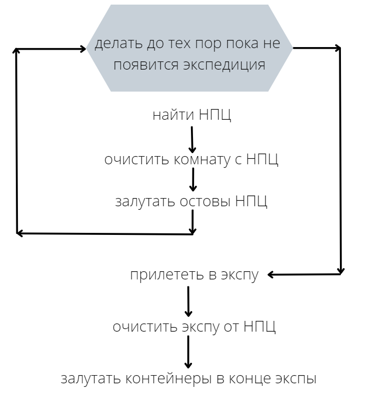

# Бот для игры EVE Online

## бот представляет из себя программу, которая управляет кораблем в игре по следующему алгоритму:

## особенности бота
- докается на станцию при наличии красных меток в локальном чате, либо каталистов в окне DScan
- следит за хп корабля и дронов
- перезаходит в игру при отключении от сервера
- имеется автопилот
- в качестве корабля подходит любая дроновозка, в идеале это worm или gila

## использованные технологии
- в проекте я заимствовал библиотеку чтения памяти из репозитория https://github.com/Arcitectus/Sanderling
- эмуляция мыши и клавиатуры происходит с помощью WinApi
- многопоточность для разделения задач, таких как слежение за чатом, за дронами, запуск главного алгоритма и др.

## настройка и запуск
1) запустить build.bat
2) в настройках графики выставить оконный режим
3) примерное расположение окон в игре:

4) запустить start.bat

возможно я мог что-то упустить в настройке бота, пишите в issues о проблемах

## любая критика приветствуется